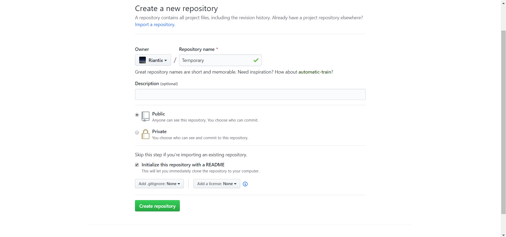
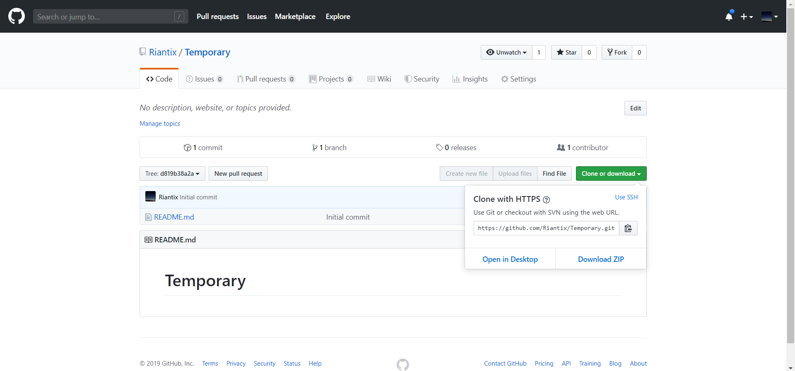
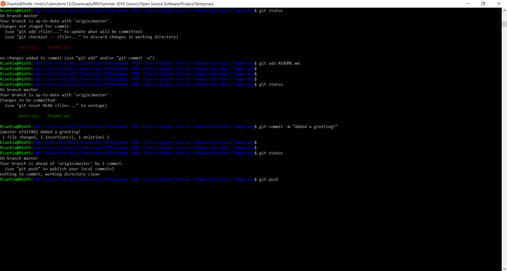
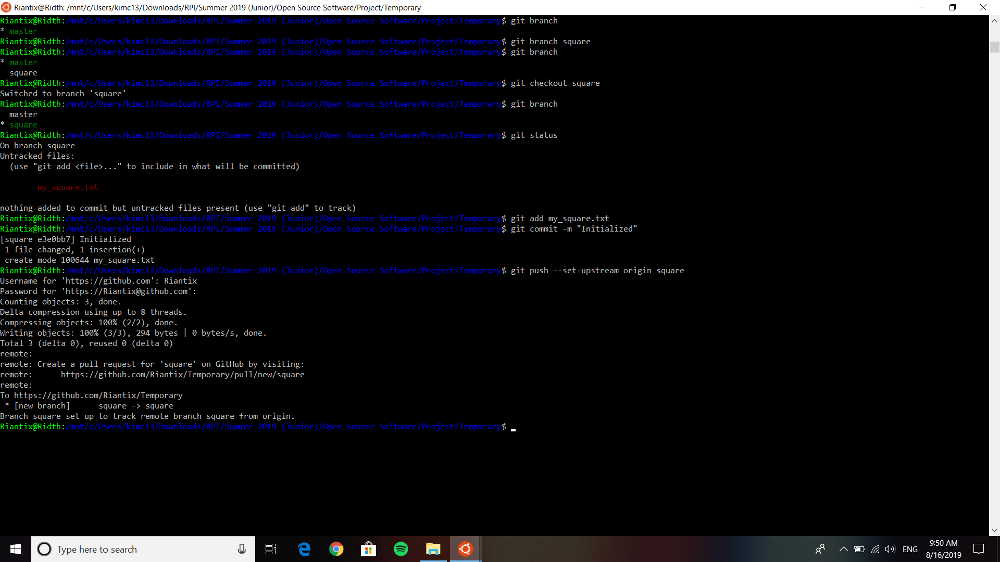

# GitHub Tutorial
RPI Campus Map and RPI Machines Map are both hosted on GitHub so 
it is important for you to be familiar with GitHub and Git
in order to contribute to either projects.

## Step 0: Create GitHub account and install git
If you don't have a GitHub account, then you can sign up for a free account
at . This will give you permission to make 
changes to the project later on.

Once you have a GitHub account, download Git 
.
You will be using Git to share your changes with everyone else.

## Step 1: Create a repository
At the top right, click on the + and click "New repository". You may name it whatever you wish.
Check the box saying "Initialize this repository with a README"

## Step 2: Clone to your machine
Currently, your new repository is on Github. While it is possible to make all your changes there,
it is much more convenient to have a copy of the repository on your computer and edit it there.
Click on the green box, "Clone or download". Copy the text or click on the clipboard to copy.
Open a terminal and cd to where you want to place your copy. Type `git clone` and paste the link you copied.

`cd ~/Documents`

`git clone https://github.com/Riantix/Temporary.git`

## Step 3: Make some changes
In your folder (mine is called Temporary), you will see a README.md file. Edit it to say "Hello Hello!".
  * After editing if you type `git status` you will notice that it says `modified: README.md` in red (under
Changes not staged for commit)

## Step 4: Push changes
Type `git add README.md`. 
  * If you now type `git status`, it will now be green and under a different list
(Changes to be committed). 

Type `git commit -m "Added a greeting!"`. You may replace the text in quotes as you wish. The message is typically helpful
text that indicates what you changed.
  * Now if you type `git status` it will say "Your branch is ahead of 'origin/master' by 1 commit.
  (use "git push" to publish your local commits)". This means that your copy is ahead of the version in Github. It's time to push!

Type `git push`. If necessary, enter your username and password.
  * Github should now be updated. Refresh the webpage to see your changes! Now everyone working on the repository can see
  your changes.

#### Quick Notes
In general, the most important things to know are cloning (to set up your local repository), pushing and pulling.
pulling is done by the `git pull` command. Pull frequently, especially before you start making changes!

## Step 5: Branches
Type `git branch` in your terminal.
  * You should see `* master`. The star indicates we are currently in the "master" branch.

Now type `git branch square`. 
  * Upon typing `git branch`, you should see "square" under "master". This means that there are two branches, "master" and "square"

Type `git checkout square`.
  * The checkout command changes your current branch to the one specified. Now, we are working in the "square" branch.
  * You can verify this by once again typing `git branch`

Create a new file. Add and commit. Push with `git push --set-upstream origin square`.
  * This push command will make your future pushes from your branch to the square branch in github.
  * Because github does not have a square branch, it will create the branch in github
  * This only needs to be done once. In the future, you can simply push with `git push`

Branches are a great way to modify and save code without breaking anything in the original master branch. If you are satisfied
with the progress in your branch, you can merge it to master. If you want to remove your progress, you can delete the branch.

## Git Terminology:
In order to make sure everyone is on the same page, here are some Git terminology
that you should use so everyone knows what you're saying.

**Pushing**:  After you make any changes to the project, you will need to publish your 
changes using Git so everyone else working on the project can see your
changes. Publishing your changes is called "pushing". 
For example, after you fixed a bug on the program and you "pushed" it on Git,
you'll tell the other people that you "pushed" the changes and they should
go check it out. 

**git add**: Adds files to be committed later.

**git commit**: Commits files that were added previously. Adding -m and "a message" gives the files a commit message. Once you
have committed, all you need to do is **git push**

**Pulling**: Getting changes someone else made onto your computer. As a general rule, pull often!

**Merging**: Occurs when both you and someone else are trying to make changes. Merging refers to combining code and resolving any issues  in doing so.

**Branch**: Copying the current code such that you can freely make changes on your branch without affecting
someone else's code. Branching is useful when you are developing other features, testing code, or making extensive changes.

## Final Notes
  * There is more to Github than pushing, pulling, cloning and branching but this is sufficient to work on RPI Campus Map and RPI Machines Map.
  * If you want more hands-on experience in committing and branching, 
  check out this great interactive guide [here](https://learngitbranching.js.org/)
  * And if you want to learn more about Github, check out [forking and pull requests](https://guides.github.com/activities/forking/).

